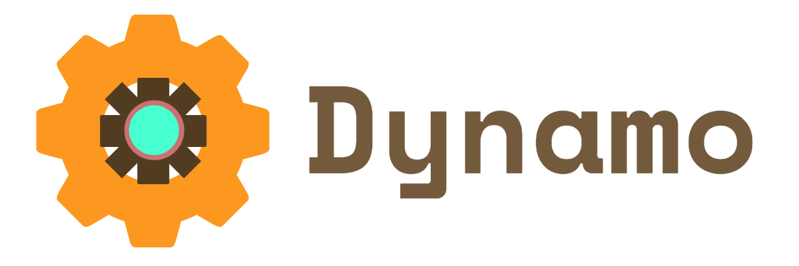

---

`Dynamo` is a C++ game engine powered by `SDL2` and its extension libraries. 

The API is meant to simplify the application development process, automating core processes like the main loop and state handling. Aside from abstracting away low-level resource management, the library offers additional game development utilities.

## Features

- A user-friendly and intuitive C++ API
- Native support for an optimized [ECS](https://en.wikipedia.org/wiki/Entity_component_system) architecture in designing game objects
- A simplified Scene management system
- Artificial intelligence utilities including [FSM](https://en.wikipedia.org/wiki/Finite-state_machine)
- Animating sprites, rasterizing primitives, and rendering text
- An audio engine that supports multiple streaming tracks and raw PCM data manipulation
- ... and more!

These features allow it to be used as a framework for general multimedia applications.

For a more in-depth look at the engine's components, visit the [__wiki__](https://github.com/SirBob01/Dynamo-Engine/wiki).

## Rationale

I built this because I've always wanted to understand how game engines worked under the hood. This is mostly a learning exercise, but I also use it for my personal projects because of its flexibility and reusability.

## Dependencies

This engine wraps around `SDL2` and its extensions:
- `SDL2_image`
- `SDL2_ttf`
- `SDL2_net`

The custom audio engine uses the `Ogg Vorbis` codec.  
Their respective development libraries must be installed.

To use `Dynamo`, the compiler must support at least C++17.

## Contributing

Anyone is welcome to open a pull request! State the issue being solved and explain the solution precisely. Just ensure that the new code adheres to the style of the codebase. 
- Maximum line width of 80 characters
- For long parameter lists, either split them across multiple lines or store them in a new (private) POD
- Only API functions and objects should be publicly accessible
- All code must be within `namespace Dynamo`

For other major suggestions on improving the engine, open an issue so we can have a discussion.

## TODO

- Move all sub-modules into specialized namespaces
- Implement A* pathfinding utility
- Refactor GUI framework
- Transition to smart pointers
- Finish implementing custom network protocol
- Migrate to the `Vulkan` API for low-level render calls

## License

Code and documentation Copyright (c) 2019-2020 Keith Leonardo

Code released under the [MIT License](https://choosealicense.com/licenses/mit/).