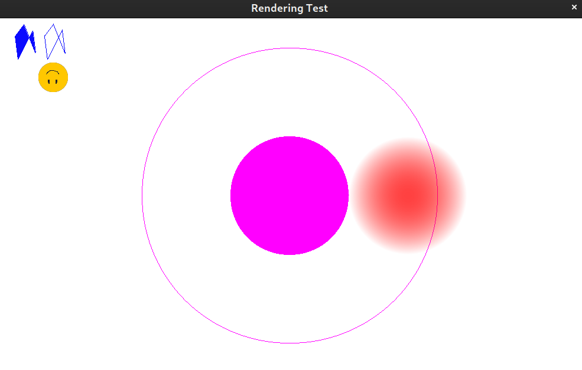
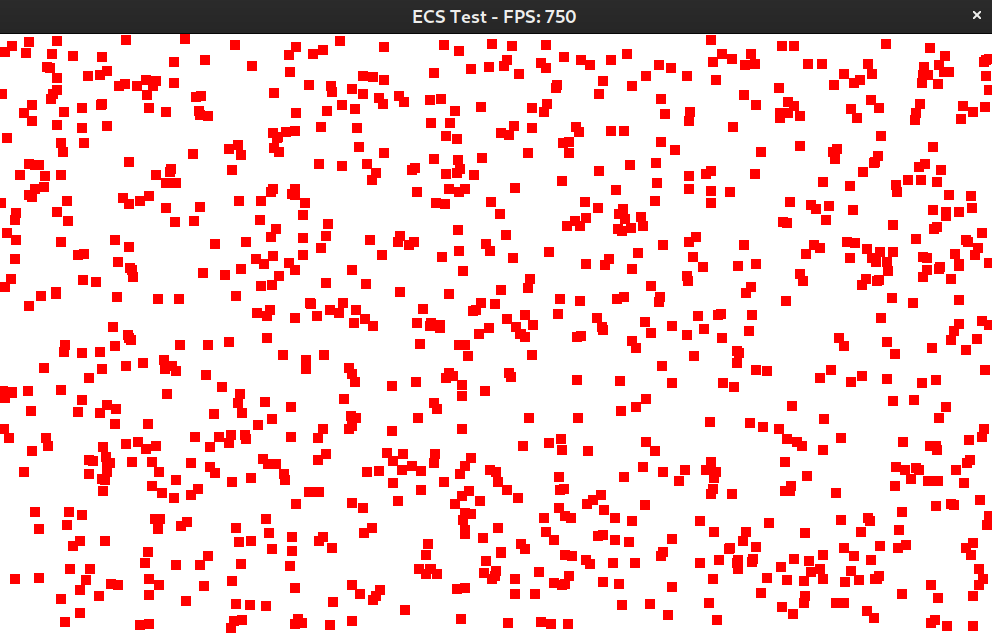
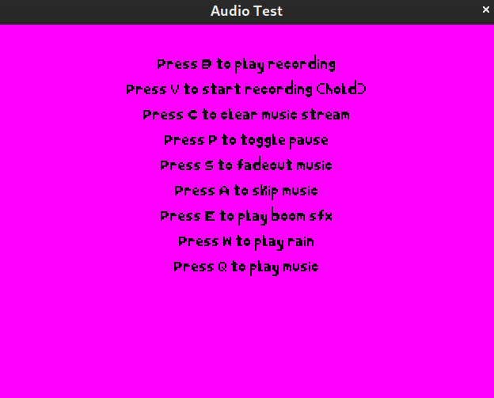
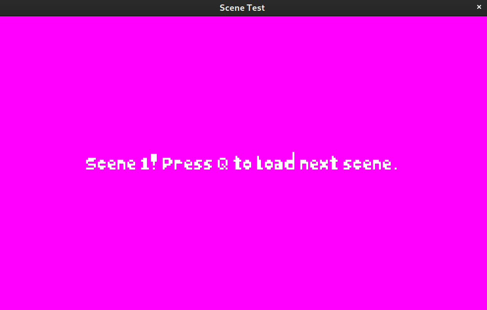

---

`Dynamo` is a C++ game engine powered by `Vulkan`.

The API is meant to simplify the application development process, automating core processes like the main loop and state handling. Aside from abstracting away low-level resource management, the library offers additional game development utilities.

## Features

- A user-friendly and intuitive C++ API
- Native support for an optimized [ECS](https://en.wikipedia.org/wiki/Entity_component_system) architecture in designing game objects
- A simplified Scene management system
- Animating sprites, rasterizing primitives, and rendering text
- An audio engine that supports multiple streaming tracks and raw PCM data manipulation
- ... and more!

These features allow it to be used as a framework for general multimedia applications.

For a more in-depth look at the engine's components, visit the [**wiki**](https://github.com/SirBob01/Dynamo-Engine/wiki).

## Screenshots

## Rationale

I built this because I've always wanted to understand how game engines worked under the hood. This is mostly a learning exercise, but I also use it for my personal projects because of its flexibility and reusability.

## Dependencies

To use `Dynamo`, the compiler must support at least C++17.

## Compiling Demos

The API comes with demo programs to test core features of the engine. To compile them, `cmake` must be installed. Go to the `/demos/build` directory, then run:

- `cmake . -G BUILD_GENERATOR`
- `make`

Replace `BUILD_GENERATOR` with the [generator](https://cmake.org/cmake/help/v3.2/manual/cmake-generators.7.html) applicable to your development environment. This assumes that all the dependency requirements are satisfied.

## Contributing

Anyone is welcome to open a pull request! State the issue being solved and explain the solution precisely. Just ensure that the new code adheres to the style of the codebase.

For high-level suggestions on improving the engine, open an issue so we can have a discussion.

## TODO

- Implement the Doppler effect (frequency and pitch shifting) in Jukebox
- Finish implementing custom network protocol

## Rewrite TODO

- `Jukebox` class
- `Renderer` submodule
- `Scene` management system
- `ECS` submodule
- Integrate `ImGUI` for engine interface
- Integrate `Mono C#` for scripting

## License

Code and documentation Copyright (c) 2019-2020 Keith Leonardo

Code released under the [MIT License](https://choosealicense.com/licenses/mit/).
